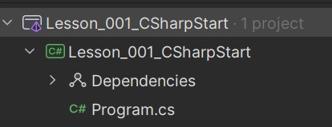

# Lesson 1. C# and .NET

The C# language is the most popular language for the [.NET platform](https://learn.microsoft.com/en-us/dotnet/csharp/), a free, cross-platform, open source development environment. C# programs can run on many different devices, from Internet of Things (IoT) devices to the cloud and everywhere in between. You can write apps for phone, desktop, and laptop computers and servers.

## Code Editors
You can use Visual Studio, VS Code or JetBrains Rider to write, debug and compile your C# projects. You can find links to install those programs below:

[**Install Visual Studio or VS Code**](https://visualstudio.microsoft.com/downloads/)

[**Install JetBrains Rider**](https://www.jetbrains.com/rider/download)

After insallation navigate to 'Console App' and create a project

## Project in C#

When you create a console project in C# the project looks like this:



Here we have a solution, dependencies and a file Program.cs. We will talk about first two in our next lessons. In file __Program.cs__ we have a class Program and a method Main - entry point. Every project starts in method Main. It usually looks like this:

```C#
namespace Lesson_001_CSharpStart  
{  
	class Program  
	{  
		public static void Main(string[] args)  
	    {  
	        Console.WriteLine("Hello world");  
	    }
	}
}
```

## Basics or C#

Now let's see how we can create our projects using **C#**

### Console input output

```C#
// Console input output  
Console.WriteLine("Text"); // write text in console and go to next line  
Console.Write("Text without enter"); // write text in console  
  
string text = Console.ReadLine(); // Read input from console  
Console.ReadKey(); // read pressed key on keyboard
```

### Data Types

There are simple data types that you will use in every project
```C#
// Data Types  
int number = 100; // numbers  
double percent = 0.05; // numbers wth floating point  
char symbol = 'A'; // ASCII symbol  
string text = "Hello"; // text
bool isProgrammingCool = true; // true or false
```
There are also other primitive data types, you can see a table of them [here](https://learn.microsoft.com/en-us/dotnet/csharp/language-reference/builtin-types/built-in-types)

You can also use type `DateTime` to work with time and date

```C#
DateTime dateTime = DateTime.Now; // current time  
Console.WriteLine(dateTime); // 27.11.2024 19:12:35  
Console.WriteLine(dateTime.Year); // 2024  
Console.WriteLine(dateTime.Day); // 27  
Console.WriteLine(dateTime.DayOfWeek); // Wednesday  
Console.WriteLine(dateTime.Microsecond); // 720
```

### Conditions

We can use `if` `else` and `else if` to create conditions. We can also use `&&`(AND) and `||`(OR) operators to make complex conditions

```C#
int age = int.Parse(Console.ReadLine());  
if (age < 12)  
{  
  Console.WriteLine("child");  
}  
else if (age >= 12 && age < 18)  
{  
  Console.WriteLine("teenager");  
}  
else  
{  
  Console.WriteLine("adult");  
}
```

> Notice: Console.ReadLine() returns **string** date type, but we need to save value into variable age, which is **int**. Here we use method **int.Parse()** to convert string to int.

You can also use `switch` to make conditions

```C#
int number = int.Parse(Console.ReadLine());  
switch (number)  
{  
  case 1:  
        Console.WriteLine("first");  
  break;  
  case 2:  
        Console.WriteLine("second");  
  break;  
  case 3:  
        Console.WriteLine("third");  
  break;  
  default:  
        Console.WriteLine(number + "th");  
  break;  
}
```

### Loops
In C# we can use 4 types of loops: `for`, `while`, `do-while` and  `foreach`.  We usually use `foreach` when we have to iterate through some elements of an array or a collection.

```C#
int[] numbers = new int[5];  
  
for (int i = 0; i < 5; i++)  
{  
	numbers[i] = i + 1;  
}  
  
foreach (int number in numbers)  
{  
	Console.WriteLine(number);  
}
```
There are also keywoards `break` and `continue` to work with loops

```C#
for (int i = 0; i < 20; i++)  
{  
  if (i % 2 == 0)  
	  continue; // skip iteration  
  
  if (i >= 10)  
	  break; // stop iterations 
	   
  Console.WriteLine(i);  
}  
// Result:  
//1  
//3  
//5  
//7  
//9
```

### Arrays

In C# we can create **single-dimensional array**, **multidimensional array** or **jagged array**

```C#
int[] numbers = new int[5]; // single-dimensional array 
  
for (int i = 0; i < numbers.Length; i++)  
{  
 numbers[i] = i + 1;  
}  
  
Console.WriteLine(string.Join(", ", numbers));
// Result: 1, 2, 3, 4, 5
```

> Notice: we use **numbers.Length** to get the count of elements in the array. It is a better way than use some number for it.
> Also notice a method **string.Join()**. It is used to write all elements in an array or a collection and add some text between them.

```C#
char[,] stars = new char[5, 4]; // two-dimensional array  
  
for (int i = 0; i < 5; i++)  
{  
  for (int j = 0; j < 4; j++)  
  { 
	  stars[i, j] = '*';  
  }
}  
  
for (int i = 0; i < stars.GetLength(0); i++)  
{  
  for (int j = 0; j < stars.GetLength(1); j++)  
  {  
	  Console.Write(stars[i, j] + " ");  
  }  
  Console.WriteLine();  
}  
// Result:  
//* * * * 
//* * * *  
//* * * *  
//* * * *  
//* * * *
```

> Notice: **stars.GetLength()** returns a length of a dimension
> stars.GetLength(0) -> 5
> stars.GetLength(0) -> 4

```C#
string[] words = new string[4]  
{  
  "I", "love", "coding", "!!!"  
};  
string[][] sentences = new string[4][];  
  
for (int i = 0; i < sentences.Length; i++)  
{ 
	sentences[i] = new string[i + 1];  
    for (int j = 0; j < sentences[i].Length; j++)  
    { 
	    sentences[i][j] = words[j]; 
	} 
}  

for (int i = 0; i < sentences.Length; i++)  
{  
	Console.WriteLine(string.Join(" ", sentences[i]));  
} 
// Result:  
//I  
//I love  
//I love coding  
//I love coding !!!
```
> Notice: To add values to array I can simply use `{}` and write values inside them

### Methods

If we have some code parts that replicates in the code, we can place them ina **method** to make our code simplier. To create a method we have to write it the next way:

```C#
public void SayHello()  
{  
  Console.WriteLine("Hello world");  
}
```

This method is constructed using the next parts:
- `access modifier` **public** - the access level of the method (see OOP Encapsulation)
- `return type` **void** - the method returns void (or nothing)
- `method name` **SayHello** - the name of a method. Should be a verb at the beginning
- `method body` **Console.WriteLine("Hello world");** - what method do

> Remember: the method must have `return type` and `method name`, other parts are not nessessary

The method can also have `optional modifier` and `parameters`.

```C#
static int GetSum(int a, int b)  
{  
  return a + b;  
}
```

Here we have new parts of the method:
- `optional modifier` **static** - makes this method statis (See OOP static keywoard)
- `parameters` **int a, int b** - parameters that we can pass when we call the method

To call this method we can simply write its name and add parameters
```C#
int sum1 = GetSum(1, 2);  
int sum2 = GetSum(4, 5); 
 
Console.WriteLine(sum1);  
Console.WriteLine(sum2);  
// Result:  
// 3  
// 9
```
> Notice: if you want to use methods in **Main()** then they must have an optional modifier `static`
